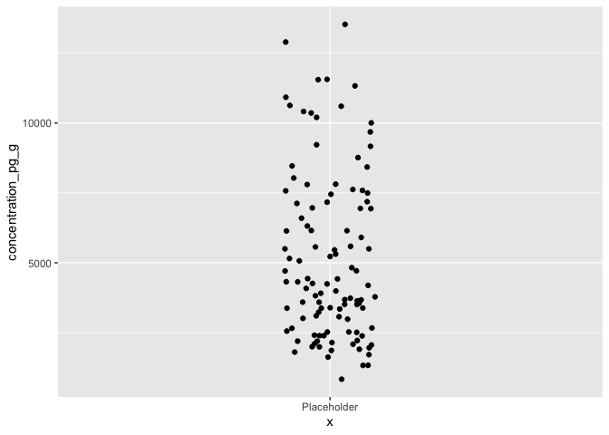
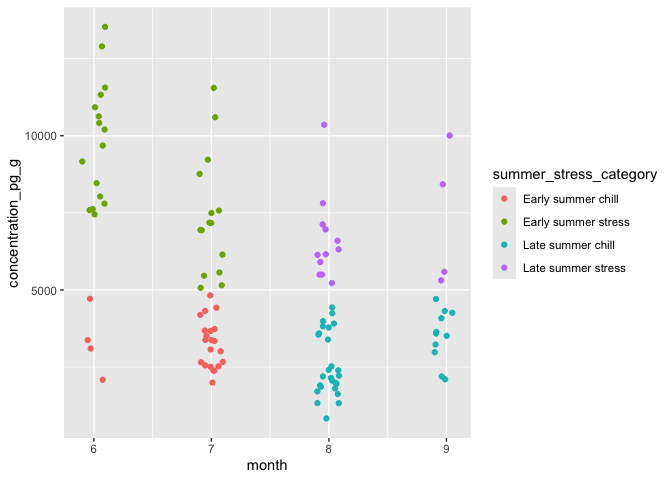

Activity 8: Computational thinking 2: conditionals
================

# Overview

Welcome! This is the second “computational thinking” lesson, which
continues work on for loops and revisits conditional statements.

------------------------------------------------------------------------

You will submit one output for this activity:

1.  A **PDF** of a rendered Quarto document with all of your R code.
    Please create a new Quarto document (e.g. don’t use this
    `README.qmd`), include all of the code that appears in this
    document, in addition to adding your own code and **answers to all
    of the questions** in the “Q#” sections. Submit this through
    Gradescope.

- For this activity, we want you to get more GitHub practice: copy this
  repository to your own GitHub as in the second activity (if you
  haven’t already been doing this). At the end, you will practice
  pushing your changes back to the repository.

------------------------------------------------------------------------

*If you have trouble submitting as a PDF, please ask Calvin or Malin for
help. If we still can’t solve it, you can submit the .qmd file instead.*

A reminder: **Please label the code** in your final submission in two
ways: 1) denote your answers to each question using headers that
correspond to the question you’re answering and 2) thoroughly “comment”
your code: remember, this means annotating your code directly by typing
descriptions of what each line does after a `#`. This will help future
you!

------------------------------------------------------------------------

Let’s start by reading in the relevant packages

``` r
library(tidyverse)
library(here)
```

------------------------------------------------------------------------

# 1. Conditionals

We’ve already worked with conditionals during one of the seaside chats,
which used `case_when()`, `dplyr's` version of an `if_else` statement.
Today we’ll walk through using `if_else` statements, the precursor to
`case_when()`, as well as get more practice with `case_when()`.

Remember the conditional statements from when we used `filter()`:

- Greater than: `>`
- Greater than or equal to: `>=`
- Less than: `<`
- Less than or equal to: `<=`
- Exactly equal to: `==`
- Not equal to: `!=`

## 1.1 if else statements

`if else` statements take the form of:

``` default
if (condition){
code to execute if condition is TRUE
} else {
code to execute if condition is FALSE
}
```

For example, below we define x as 5, then write a statement that checks
whether or not a statement, `x > 10`, is TRUE. If it’s true, it will
print out the first part. If not, it will print the second.

``` r
x <- 5

# Check if the value of x is greater than 10
if(x > 10)
{ 
  # Paste takes the value stored in x and combines that with a character string
  print(paste(x, "is greater than 10")) 
} else
{ 
  print(paste(x, "is less than or equal to 10")) 
}
```

    [1] "5 is less than or equal to 10"

### Q1.1: Modify the value of x

Copy/paste this example but change x to be 11. What is the output of the
if else statement?

------------------------------------------------------------------------

### Using `traceback()` for errors

There are many ways to get help with errors in R. The `traceback()`
function is one, and it prints out a summary of how your code arrived at
the error you received.

Consider this if else statement:

``` r
x <- 5

# Check if the value of x is greater than 10
if(x > 10)
{ 
  # If x is > 10, multiple x by 2
  print(x*2)
} else
{ 
  # If x is not > 10, divide x by 2  
  print(x/2) 
}
```

    [1] 2.5

Let’s change the `x <- 5` to `x <- "five"`. Run this code, which
attempts to do math on a character string, and immediately run
`traceback()` afterwards.

Remember, this will give you an error if you try to render the document,
so substitute the `{r}` for `{r eval = FALSE}` when in the source
editor.

``` r
x <- "five"

# Check if the value of x is greater than 10
if(x > 10)
{ 
  # If x is > 10, multiple x by 2
  print(x*2)
} else
{ 
  # If x is not > 10, divide x by 2  
  print(x/2) 
}
```

In this example, `traceback()` prints `1: print(x * 2) at #4`. `1:`
tells you that this is the first thing it tried to do. The `print(x*2)`
tells you what it tried to do that didn’t work, and `at #4` means the
error is at line \#4. This can be particularly helpful if you are
running a big function, loop, series of functions, etc, and need to
figure out exactly when and where that pesky error started.

You can read more about debugging and the `traceback()` function in
particular at this link: <https://adv-r.hadley.nz/debugging.html>
(`traceback()` in section 22.3)

------------------------------------------------------------------------

### Adding another condition

Let’s make it a little more complex by adding a third conditional. The
if else statements in R can be nested together to form multiple
statements and will evaluate expressions based on the conditions one by
one, beginning from the outer condition to the inner one.

Here, we will make R print one thing if x is less than 10, something
else if x is equal to 10, and a third thing if x is greater than 10.

``` r
# define a variable
x <- 10

# check the value of x using nested if-else statements
if (x < 10) {
  # if x is less than 10
  print("x is less than 10")
} else {
  # if x is exactly equal to 10
  if (x == 10) {
    print("x is 10!!!")
  } else {
    # if x is greater than 10
    print("x is greater than 10")
  }
}
```

    [1] "x is 10!!!"

Run the statement above with `x = 9`, `x = 10`, and `x = 11` to see what
happens. No need to re-paste the code; just change the x value and rerun
the if else statement below it.

------------------------------------------------------------------------

Let’s combine what we learned about for loops with an if else statement.
The goal here is to take a vector of numbers, loop through it, and apply
our if else statement to each element in the vector, telling us if it’s
less than, equal to, or greater than 10.

First define a vector to loop through:

``` r
vec <- c(9, 10, 11, 12)
```

Then we start the for loop:

``` r
# For 1 through the length of the vector "vec" 
for (i in 1:length(vec)) {
  
  # check the value of using nested if-else statements
  if (vec[i] < 10) {
    # if the element is less than 10
    print("value is less than 10")
  } else {
    # if the element is exactly equal to 10
    if (vec[i] == 10) {
      # if the element equals 10
      print("value is 10!!!")
    } else {
      # if the element is greater than 10
      print("value is greater than 10")
    }
  }
  
}
```

    [1] "value is less than 10"
    [1] "value is 10!!!"
    [1] "value is greater than 10"
    [1] "value is greater than 10"

The for loop iterates through the vector and applies the if else
statement separately for each vector element, printing an output for
each number.

------------------------------------------------------------------------

### Q1.2: Create a new for loop + if else statement

Remake a similar for loop / if else statement as above. The for loop
should loop through a vector called `y` that has the values
`-2, 42, 0, 10` and should assess whether or not the values are
negative, positive, or equal to zero.

First define a vector to loop through, then run the for loop / if else
statement.

------------------------------------------------------------------------

## 1.2 `case_when()` and pikas

Let’s return to the `tidyverse` and revisit `case_when()`, `dplyr`’s
version of the if else statement. We will work with the
`lterdatasampler` data again, so let’s load in those two packages:

``` r
library(lterdatasampler)
library(tidyverse)
```


Today we will work with the pika data, `nwt_pikas`! From the vignette on
the `lterdatasampler` package:

“*Researchers at the Niwot Ridge Long Term Ecological Research Site (NWT
LTER) seek to study and monitor the health of the Colorado Rockies over
time. Because of external factors like climate change, it’s more
important than ever for scientists to understand how and why the Rockies
are changing.*”

“*The American pika (*Ochotona princeps*) is a key species present at
the NWT LTER. Despite their small size, pikas can be very informative
about the health of the ecosystem. If pikas are more stressed, it can
suggest that their habitat has declined in quality. As a result, the
study of pikas is critical to the Colorado Rockies ecosystem.*”

Also, these study sites are very close to where Calvin grew up :)

------------------------------------------------------------------------

### Q1.3: How do the researchers measure pika stress?

Navigate to the help page of this dataset and read up on the dataset. In
a couple sentences, describe how the researchers measured pika stress,
including how they did it, what the “stress” variable is called, and
what the units are.

------------------------------------------------------------------------

### Q1.4: What does a row represent in this data?

What does a row represent in this dataset? Is it an average value from a
site? From a station? From an individual pika? From an individual pika
poop? From a subsample of a pika poop?

------------------------------------------------------------------------

### Categorize stress

The researchers measured stress on a continuous scale in the
`concentration_pg_g` column. To practice using `case_when()`, let’s turn
this into a categorical variable by assigning an arbitrary threshold
after which we call a pika “stressed” (warning: this is not endorsed by
Pika Science).

First let’s look at a distribution of the values in the
`concentration_pg_g` column in two ways to see if there are any natural
breakpoints:

``` r
# Make a histogram
nwt_pikas %>% 
  ggplot(aes(x = concentration_pg_g)) +
  # Add the histogram geom, which only needs an x-axis
  # Choose a binwidth of 500 picogram GCM/gram
  geom_histogram(binwidth = 500,
                 fill = "white",
                 color = "black")
```


``` r
# Make a scatterplot with jittered points
nwt_pikas %>% 
  # We're adding a little placeholder axis just so we can see the point distribution
  ggplot(aes(x ="Placeholder", 
             y = concentration_pg_g)) +
  # Add the geom_jitter geom
  geom_jitter(width = 0.1)
```



It looks like a lot of the data points are concentrated before 5000 or
6000, after which there’s a long tail of data. Let’s arbitrarily choose
5000 as the threshold after which pikas become stressed (again, NOT
endorsed by Big Pika Science).

Let’s create a new column with a `mutate` and a `case_when`. Let’s call
the new column `stress_category` and have it equal “Stressed!!!!!!” when
the `concentration_pg_g` column is greater than 5000, and “Chill” when
it’s less than or equal to that value.

``` r
nwt_pikas_categ <- nwt_pikas %>% 
  # Call the new column stress_category
  mutate(stress_category = case_when(
    # When the value is > 5000, make the new column's value "Stressed!!!!"
    concentration_pg_g > 5000 ~ "Stressed!!!!!!",
    # Otherwise, make the new column's value "Chill"
    .default = "Chill"
  ))

# Check out the first 6 rows, but remove the utm columns just for visibility
head(nwt_pikas_categ %>% select(-c(utm_easting, utm_northing)))
```

    # A tibble: 6 × 7
      date       site       station  sex   concentration_pg_g elev_m stress_category
      <date>     <fct>      <fct>    <fct>              <dbl>  <dbl> <chr>          
    1 2018-06-08 Cable Gate Cable G… male              11563.  3343. Stressed!!!!!! 
    2 2018-06-08 Cable Gate Cable G… male              10629.  3353. Stressed!!!!!! 
    3 2018-06-08 Cable Gate Cable G… male              10924.  3358. Stressed!!!!!! 
    4 2018-06-13 West Knoll West Kn… male              10414.  3578. Stressed!!!!!! 
    5 2018-06-13 West Knoll West Kn… male              13531.  3584. Stressed!!!!!! 
    6 2018-06-13 West Knoll West Kn… <NA>               7799.  3595. Stressed!!!!!! 

### Q1.5: Remake the scatterplot, but color the points by the new stress category

Remake our scatterplot from above, but this time color the points by the
new category we just made.

Hopefully you can now visualize what that `case_when()` statement did
with the information we gave it.

Let’s add in another categorization, this time based on the time of
year. First, we’ll create a new “month” column based on the date column.
The date column is in `date` format, which R recognizes as such, so
functions in the `lubridate` package (already loaded within `tidyverse`)
can help us easily

``` r
nwt_pikas_categ2 <- nwt_pikas_categ %>% 
  # Create a new column called month
  # then, extract the month from the date using the month() function
  mutate(month = month(date)) %>% 
  # Lastly, relocate the month column after the date column so it's more easily visible to us
  relocate(month, .after = date)

head(nwt_pikas_categ2)
```

    # A tibble: 6 × 10
      date       month site       station      utm_easting utm_northing sex  
      <date>     <dbl> <fct>      <fct>              <dbl>        <dbl> <fct>
    1 2018-06-08     6 Cable Gate Cable Gate 1      451373      4432963 male 
    2 2018-06-08     6 Cable Gate Cable Gate 2      451411      4432985 male 
    3 2018-06-08     6 Cable Gate Cable Gate 3      451462      4432991 male 
    4 2018-06-13     6 West Knoll West Knoll 3      449317      4434093 male 
    5 2018-06-13     6 West Knoll West Knoll 4      449342      4434141 male 
    6 2018-06-13     6 West Knoll West Knoll 5      449323      4434273 <NA> 
    # ℹ 3 more variables: concentration_pg_g <dbl>, elev_m <dbl>,
    #   stress_category <chr>

Now, let’s change the categories so that it also includes some info
about the time of the summer that these stress values were sampled. If
the month is June or July (6 or 7) AND the GCM concentration is \> 5000,
let’s call that “Early summer stress”, vs “Early summer chill” if it’s
less than or equal to 5000. Let’s also repeat that with the late summer,
August and September (8 or 9).å

``` r
nwt_pikas_summerstress <- nwt_pikas_categ2 %>% 
  mutate(summer_stress_category = case_when(
    (month == 6 | month == 7) & concentration_pg_g > 5000 ~ "Early summer stress",
    (month == 6 | month == 7) & concentration_pg_g <= 5000 ~ "Early summer chill",
    (month == 8 | month == 9) & concentration_pg_g > 5000 ~ "Late summer stress",
    (month == 8 | month == 9) & concentration_pg_g <= 5000 ~ "Late summer chill",
    .default = "NA"
  ))

head(nwt_pikas_summerstress)
```

    # A tibble: 6 × 11
      date       month site       station      utm_easting utm_northing sex  
      <date>     <dbl> <fct>      <fct>              <dbl>        <dbl> <fct>
    1 2018-06-08     6 Cable Gate Cable Gate 1      451373      4432963 male 
    2 2018-06-08     6 Cable Gate Cable Gate 2      451411      4432985 male 
    3 2018-06-08     6 Cable Gate Cable Gate 3      451462      4432991 male 
    4 2018-06-13     6 West Knoll West Knoll 3      449317      4434093 male 
    5 2018-06-13     6 West Knoll West Knoll 4      449342      4434141 male 
    6 2018-06-13     6 West Knoll West Knoll 5      449323      4434273 <NA> 
    # ℹ 4 more variables: concentration_pg_g <dbl>, elev_m <dbl>,
    #   stress_category <chr>, summer_stress_category <chr>

Note the use of parentheses around the “or” statements,
e.g. `(month == 6 | month == 7)`. This tells `case_when()` to first
evaluate whether the month column is 6 or 7, and THEN evaluate whether
the GCM concentration is \> 5000. If I left out the parentheses (which I
mistakenly did when creating this assignment), `case_when()` would look
at whether then month is 6 OR whether the GCM concentration is \> 5000
with the month == 7. This would mean that regardless of GMC
concentration, any row with month == 6 would be assigned “Early summer
stress”, regardless of GMC concentration. If you want to visualize this,
remove the parentheses and run the graph below, then compare that graph
with that happens when you include the parentheses.

Let’s visualize this with a scatterplot again to see what happened, this
time with month on the x axis

``` r
# Make a scatterplot with jittered points
nwt_pikas_summerstress %>% 
  # We're adding a little placeholder axis just so we can see the point distribution
  ggplot(aes(x = month, 
             y = concentration_pg_g,
             color = summer_stress_category)) +
  # Add the geom_jitter geom
  geom_jitter(width = 0.1)
```



------------------------------------------------------------------------

# 2. DIY a for loop and an if else statement / case when

Now it’s your turn: Choose a dataset that we’ve used in this class
before and perform two actions on it:

1.  Write a for loop to iterate through the dataset in some way
2.  Apply an if else OR a case_when() statement to the dataset in some
    way

This is purposefully vague: it is your choice about what to do. Revisit
both computational thinking activities to get some ideas. Neither has to
be complicated, but make sure that you explain what you are doing and
annotate your code.

------------------------------------------------------------------------

### Q2.1 What dataset are you using?

------------------------------------------------------------------------

## For loop

### Q2.2 Write a couple sentences describing what you want to do with the for loop

Before executing the for loop, write a couple sentences clearly
describing what it is that you are trying to accomplish.

------------------------------------------------------------------------

### Q2.3 Apply the for loop to this dataset

Apply a for loop in some way to this dataset. Describe what you are
doing in comments on each line.

------------------------------------------------------------------------

## If else / case_when

### Q2.4 Write a couple sentences describing what you want to do with the if else/case_when

Before executing the if else or case_when, write a couple sentences
clearly describing what it is that you are trying to accomplish.

------------------------------------------------------------------------

### Q2.5 Apply an if else or case_when to this dataset

Apply an if else or case_when in some way to this dataset. Describe what
you are doing in comments on each line.

------------------------------------------------------------------------

When you have finished, practice the GitHub push/pull:

- Pull to check for updates to the remote branch
- Stage your edits (after saving your document!) by checking the
  documents you’d like to push
- Commit your changes with a commit message
- Push your changes to the remote branch
